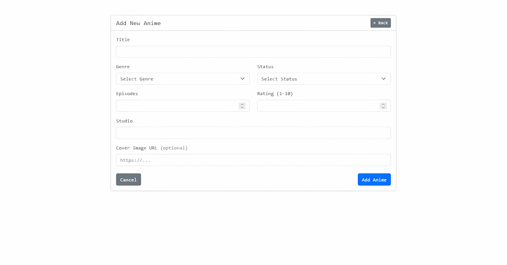
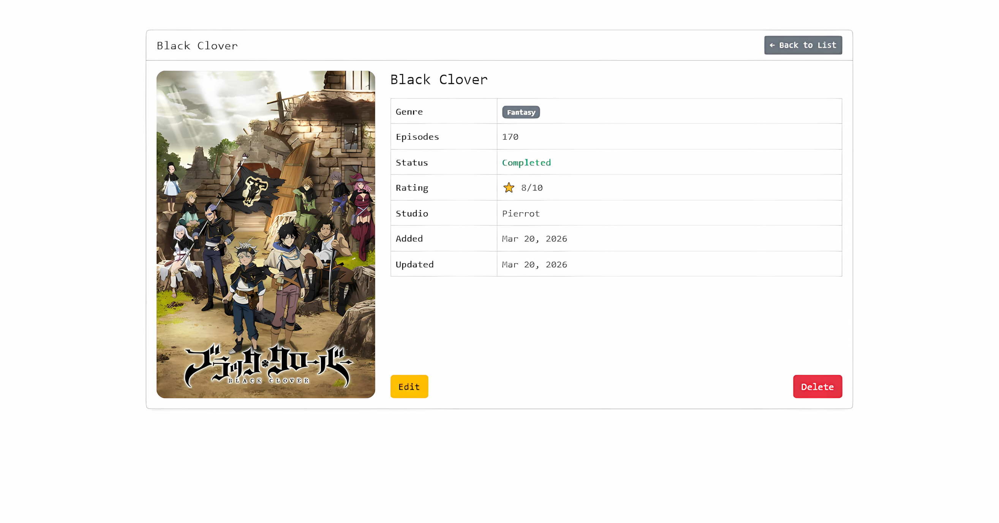
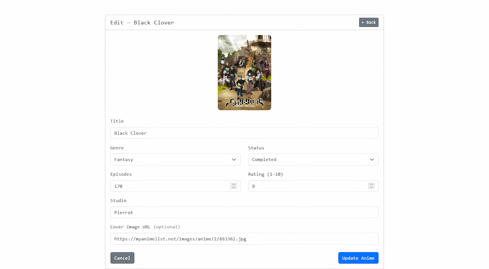

# Anime List Management System


A simple CRUD application for managing a personal anime watch list.

---

## Database Fields

| Field         | Type      | Description                                                            |
| ------------- | --------- | ---------------------------------------------------------------------- |
| `id`          | integer   | Primary key                                                            |
| `title`       | string    | Anime title                                                            |
| `genre`       | enum      | Action, Romance, Isekai, Fantasy, Slice of Life, Horror, Sports, Mecha |
| `episodes`    | integer   | Total episode count                                                    |
| `status`      | enum      | Watching, Completed, Plan to Watch, Dropped                            |
| `rating`      | integer   | Personal rating from 1 to 10                                           |
| `studio`      | string    | Animation studio                                                       |
| `cover_image` | string    | Cover image URL (optional)                                             |
| `created_at`  | timestamp | Auto-generated                                                         |
| `updated_at`  | timestamp | Auto-generated                                                         |

---

## Screenshots

> Index - Anime List


> Create - Add Anime



> Show - Anime Details



> Edit - Update Anime



> Delete - Remove Anime


---

## Installation

**Requirements:** Git, PHP, Composer, Laravel

```bash
git clone https://github.com/xoptech/anime-list.git
cd anime-list
composer install
cp .env.example .env
php artisan key:generate
php artisan migrate:fresh --seed
php artisan serve
```

Then open `http://127.0.0.1:8000` in your browser.
